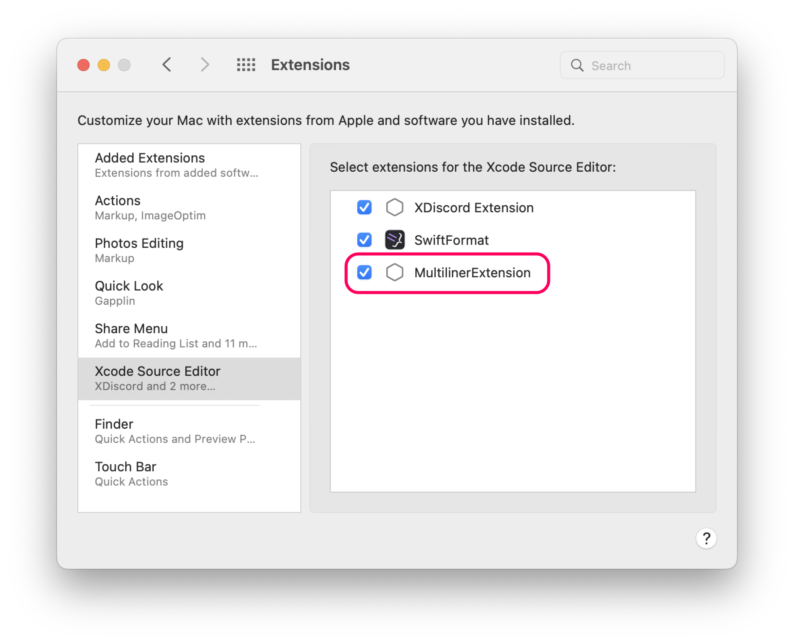
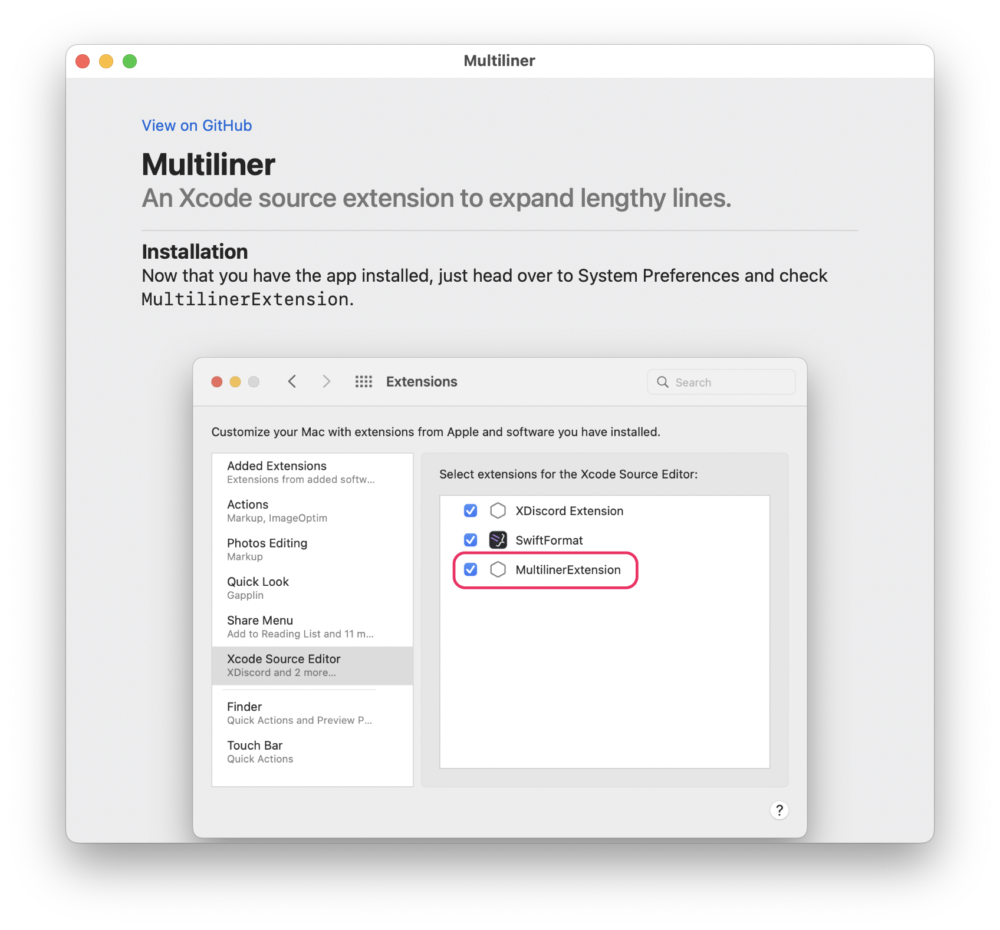

# Multiliner

An Xcode source extension to expand lengthy lines.

- Super lightweight, 1 file.
- It expands long lines. That's it!
- Works with:
  - Initializers
  - Function calls
  - Array literals
  - SwiftUI modifiers

### Showcase

https://user-images.githubusercontent.com/49819455/176060861-4bab03cc-a953-4839-b04e-cf05864f879e.mp4

### Installation

1. Download the app [here](https://github.com/aheze/Multiliner/raw/main/Multiliner.zip)
2. Open the app
3. Go to System Preferences → Extensions and check `MultilinerExtension`



### Usage

It's simple, just highlight the code that you want to format and press Editor → Multiliner → Format Selected Code. More instructions in the app.




### Author
Multiliner is made by [aheze](https://github.com/aheze).

### Contributing
All contributions are welcome. Just [fork](https://github.com/aheze/Multiliner/fork) the repo, then make a pull request.

### Need Help?
Open an [issue](https://github.com/aheze/Multiliner/issues) or join the [Discord server](https://discord.com/invite/Pmq8fYcus2). You can also ping me on [Twitter](https://twitter.com/aheze0). Or read the source code, I added a bunch of comments.

### License

```
MIT License

Copyright (c) 2022 A. Zheng

Permission is hereby granted, free of charge, to any person obtaining a copy
of this software and associated documentation files (the "Software"), to deal
in the Software without restriction, including without limitation the rights
to use, copy, modify, merge, publish, distribute, sublicense, and/or sell
copies of the Software, and to permit persons to whom the Software is
furnished to do so, subject to the following conditions:

The above copyright notice and this permission notice shall be included in all
copies or substantial portions of the Software.

THE SOFTWARE IS PROVIDED "AS IS", WITHOUT WARRANTY OF ANY KIND, EXPRESS OR
IMPLIED, INCLUDING BUT NOT LIMITED TO THE WARRANTIES OF MERCHANTABILITY,
FITNESS FOR A PARTICULAR PURPOSE AND NONINFRINGEMENT. IN NO EVENT SHALL THE
AUTHORS OR COPYRIGHT HOLDERS BE LIABLE FOR ANY CLAIM, DAMAGES OR OTHER
LIABILITY, WHETHER IN AN ACTION OF CONTRACT, TORT OR OTHERWISE, ARISING FROM,
OUT OF OR IN CONNECTION WITH THE SOFTWARE OR THE USE OR OTHER DEALINGS IN THE
SOFTWARE.
```
